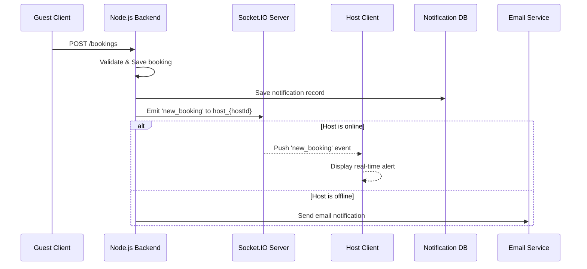
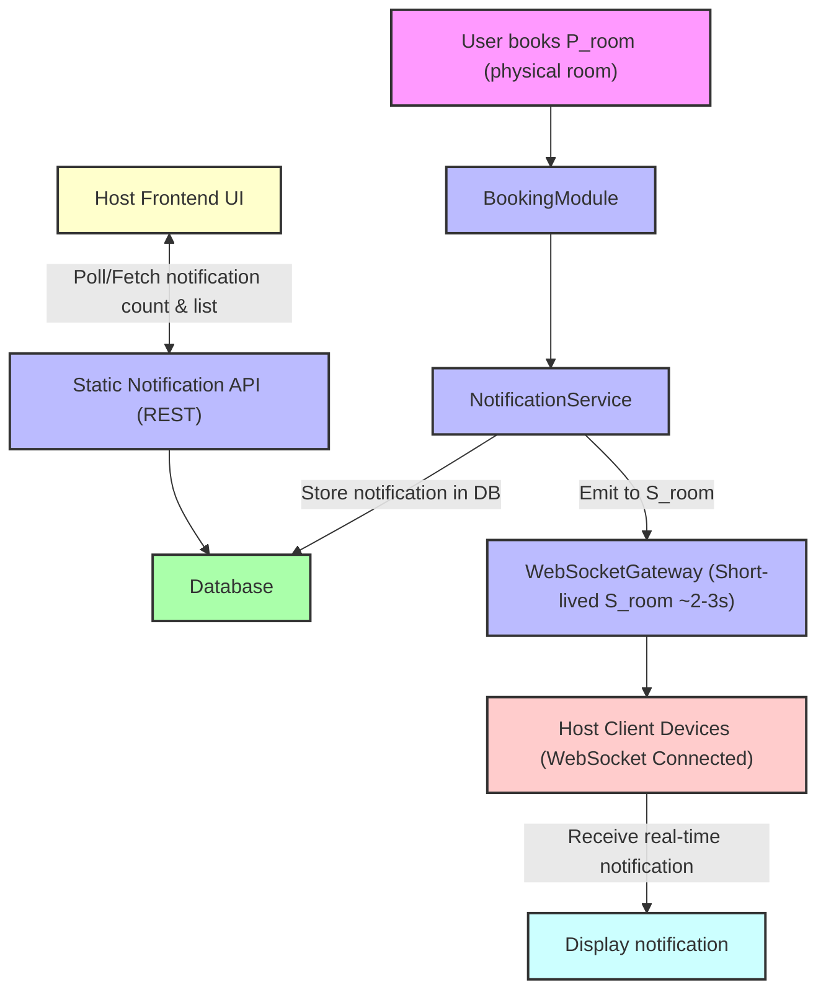

# 📡 Hybrid Notification System – Implementation Roadmap

Supports both real-time (WebSocket) and static (API-based) notifications for hosts after P_room bookings.

## ✅ Phase 0: Planning

- Define architecture flow (real-time + static)
- Decide on short-lived WebSocket strategy (~2–3s)
- Confirm frontend integration points (WebSocket + API badge)

## 🧱 Phase 1: Core Notification Logic

- Create NotificationService module
- Define NotificationEntity or schema (if using DB)
- Implement NotificationService.storeNotification() method
- Trigger this method from BookingModule after successful booking
- Unit test notification creation with fake bookings

## 🌐 Phase 2: Static Notification API

- Create GET /notifications/count endpoint (per hostId)
- Create GET /notifications/list endpoint (with pagination)
- Create POST /notifications/mark-read endpoint (optional)
- Add proper JWT auth guard to endpoints
- Test endpoints via Postman or Swagger

## 🖥️ Phase 3: Frontend - Static Notifications

- Create notification badge icon (unread count)
- Poll GET /notifications/count on page load or interval
- Display count in UI
- Create notification dropdown/list (optional)
- Mark notifications as read (if required)

## 🔌 Phase 4: WebSocket Gateway (Real-Time)

- Create NotificationGateway using @WebSocketGateway()
- Add JWT handshake validation on connect
- Join socket to host-{hostId} room after auth
- Emit notification to S_room from NotificationService
- Implement TTL (disconnect after 2–3 seconds)
- Test with frontend WebSocket client (manual connection)

## 🔄 Phase 5: Frontend - Real-Time Socket Client

- Connect to WebSocket server on host login
- Authenticate via JWT token during handshake
- Listen to real-time notification events
- Trigger UI alert / toast / refresh on event
- Auto-disconnect socket after 2–3 seconds or on first delivery

## 🛡️ Phase 6: Security & Edge Cases

- Throttle API endpoints to prevent abuse
- Secure WebSocket access (JWT, room join authorization)
- Handle socket errors and reconnect logic (if needed)
- Validate S_room naming and structure to prevent leakage
- Ensure backend fallbacks when no socket is connected

## ⚙️ Phase 7: Optional Scaling Enhancements

- Use Redis adapter for multi-instance socket support
- Store notifications in Redis or DB for persistence
- Add metrics/logging for delivery success/failure
- Add admin audit logs (who saw what, when)

## 📦 Bonus Features (Future)

- Add push notifications via Firebase (FCM) or Apple Push
- Enable email fallback for offline hosts
- Let hosts customize notification preferences
- Notification categories/types (e.g., bookings, reviews, messages)



| Component                            | Dependencies                          | Can Be Built Independently? | Notes                                              |
| ------------------------------------ | ------------------------------------- | --------------------------- | -------------------------------------------------- |
| **BookingModule**                    | Your existing booking logic           | ✅ Already exists           | You only need to emit a notification event/call    |
| **NotificationService**              | BookingModule (via method call/event) | ✅ Yes                      | Can mock data input during dev/testing             |
| **Notification DB (or Queue)**       | NotificationService                   | ✅ Yes                      | You can start with in-memory or file-based storage |
| **WebSocketGateway**                 | Host frontend + NotificationService   | ✅ Yes                      | Can develop/test real-time delivery separately     |
| **Static Notification API**          | Notification DB                       | ✅ Yes                      | Fully decoupled — works even without WebSocket     |
| **Frontend WebSocket Client**        | WebSocketGateway                      | ✅ Yes                      | Can develop frontend with mocked gateway           |
| **Frontend Notification UI (badge)** | Static Notification API               | ✅ Yes                      | Common UX pattern, API can be stubbed early        |

| Phase | What to Build                                     | Depends On            | Testing Approach                      |
| ----- | ------------------------------------------------- | --------------------- | ------------------------------------- |
| 1️⃣    | NotificationService + Static DB Store             | BookingModule         | Unit test with fake bookings          |
| 2️⃣    | Static Notification API (`/count`, `/list`)       | Notification DB       | Manual testing via Postman or UI      |
| 3️⃣    | Frontend badge + list UI                          | Static API            | Mock data or real API                 |
| 4️⃣    | WebSocketGateway with JWT auth                    | Frontend WebSocket    | Local connection with test tokens     |
| 5️⃣    | Emit from NotificationService to WebSocketGateway | NotificationService   | Manual or auto-emission               |
| 6️⃣    | Short-lived WebSocket behavior (2–3s TTL)         | WebSocketGateway      | Use `setTimeout` or similar           |
| 7️⃣    | Auto-disconnect + fallback to static              | Both channels working | Observe delivery under various states |
| 🔁    | Optional: Redis adapter, push fallback            | Scale & reliability   | Future-proofing only                  |

````pgsql
src/
└── notification/
    ├── dto/
    │   ├── create-notification.dto.ts
    │   ├── get-notification-count.dto.ts
    │   ├── get-notification-list.dto.ts
    │   └── mark-notification-read.dto.ts
    ├── entities/
    │   └── notification.entity.ts
    ├── interfaces/
    │   └── notification.interface.ts
    ├── notification.module.ts
    ├── notification.service.ts
    ├── notification.controller.ts
    └── notification.gateway.ts   <-- Optional: Real-time WebSocket Gateway
    ```
````
