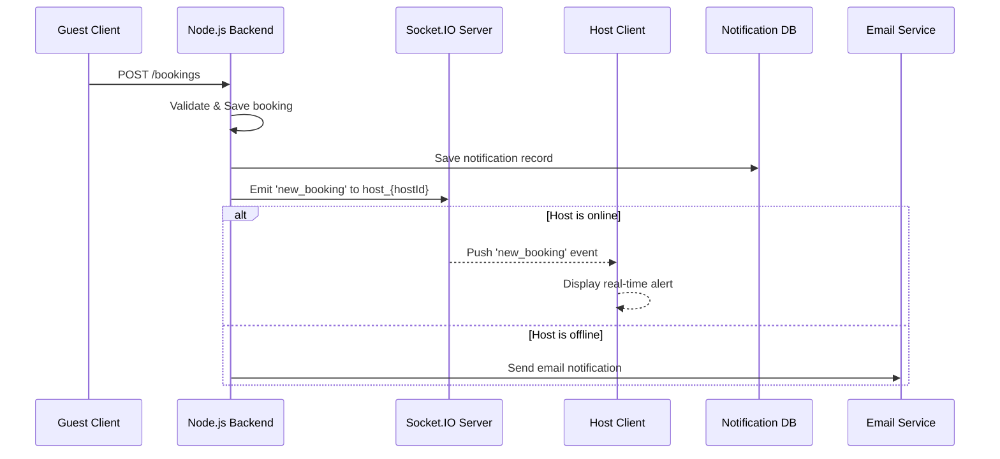

```mermaid
sequenceDiagram
    participant Guest as Guest Client
    participant Backend as Node.js Backend
    participant Socket as Socket.IO Server
    participant Host as Host Client
    participant DB as Notification DB
    participant Email as Email Service

    Guest->>Backend: POST /bookings
    Backend->>Backend: Validate & Save booking
    Backend->>DB: Save notification record
    Backend->>Socket: Emit 'new_booking' to host_{hostId}
    alt Host is online
        Socket-->>Host: Push 'new_booking' event
        Host-->>Host: Display real-time alert
    else Host is offline
        Backend->>Email: Send email notification
    end


```
