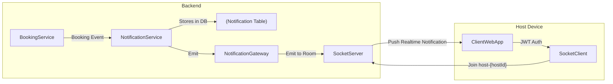

# Connection Lifecycle

| Step                 | Action                                                        |
| -------------------- | ------------------------------------------------------------- |
| 🔐 On Connect        | Validate JWT, extract `userId`, and join `host-{id}` room     |
| 🛑 After 2–3 seconds | (Optionally) auto-disconnect socket (based on your TTL model) |
| 📬 On Booking Event  | NotificationService emits to `host-{id}`                      |
| 📥 Client Receives   | Frontend listens for `notification` event                     |

# 🔐 Security: JWT over Socket.io

Use @UseGuards(WsJwtGuard) to protect connections.

Client sends token in query or header:

```ts
const socket = io('/ws/notifications', {
  auth: { token: 'jwt_token_here' },
});
```

# 🧠 Summary of Internal Flow

1. BookingService calls NotificationService.create(...)
2. NotificationService stores notification in DB
3. NotificationService emits via NotificationGateway
4. NotificationGateway sends message to host-{hostId} room
5. Connected host clients receive notification event
6. Frontend shows popup/snackbar/alert

# ✅ Summary of Deliverables for This Phase

| Component                          | Responsibility                             |
| ---------------------------------- | ------------------------------------------ |
| `NotificationGateway`              | Handles socket connection, room join, emit |
| `WsJwtGuard`                       | Authenticates socket connections via JWT   |
| `NotificationService.emitToHost()` | Emits to `host-{id}` socket room           |
| `Frontend WebSocket Client`        | Listens for `notification` events          |
| TTL Handler (optional)             | Disconnects client after X seconds         |
